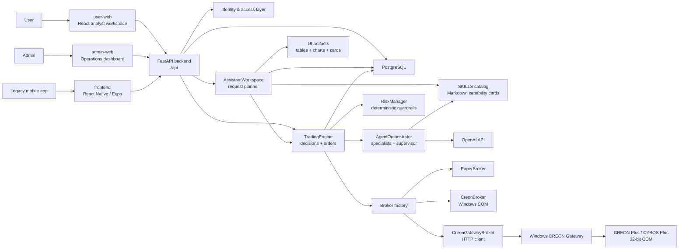
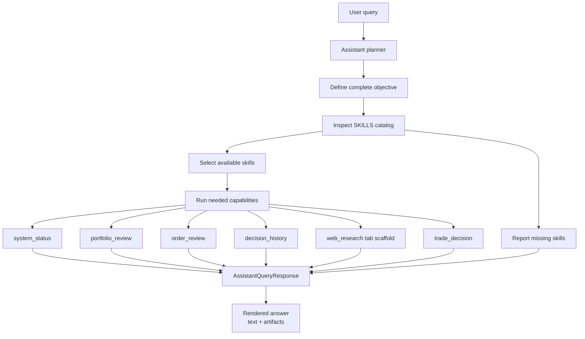
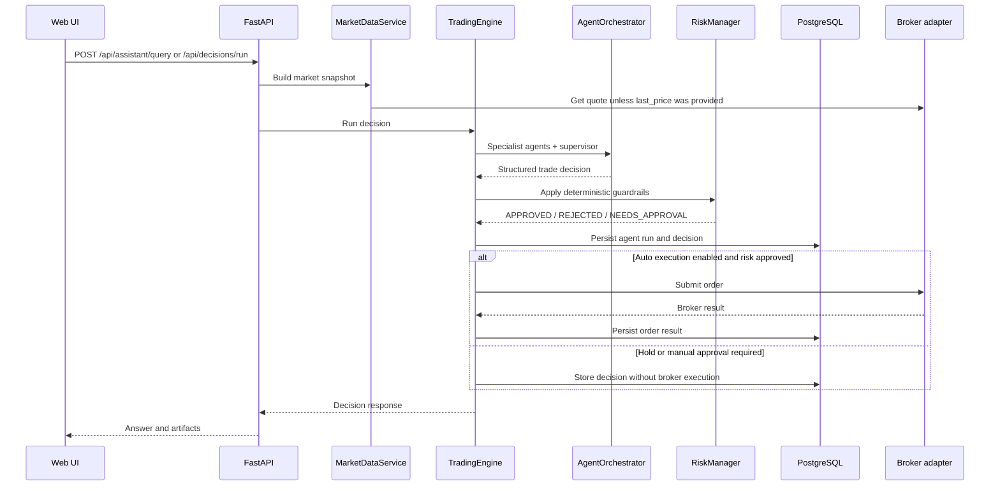

# Trade-pilot

Trade-pilot is a full-stack trading assistant for Korean equities. It combines
an analyst-style React web workspace, a FastAPI backend, OpenAI-powered agent
workflows, deterministic risk controls, paper trading, and optional CREON
Plus integration through a Windows gateway.

The project is designed as trading infrastructure scaffolding. It is not
financial advice, and live brokerage access is disabled by default.

## What It Does

| Area                   | Functionality                                                                                                                                        |
| ---------------------- | ---------------------------------------------------------------------------------------------------------------------------------------------------- |
| AI assistant workspace | Users ask natural-language trading or portfolio questions and receive structured responses, not just chat text.                                      |
| Multi-artifact answers | Responses can include text, metrics, tables, line charts, bar charts, pie charts, decision cards, and browser-style research tabs.                   |
| Skill-aware planning   | The assistant inspects Markdown skill cards before choosing which internal capability to use. Missing capabilities are reported instead of invented. |
| AI trade decisions     | Specialist agents and a supervisor produce structured BUY, SELL, or HOLD decisions.                                                                  |
| Risk controls          | Deterministic checks enforce confidence thresholds, position limits, order size limits, human approval, and live-trading gates.                      |
| Paper trading          | The default broker is a safe paper adapter for local testing.                                                                                        |
| CREON Plus integration | Optional Windows-native gateway can bridge to CREON Plus / CYBOS Plus COM APIs.                                                                      |
| Authenticated web app  | Users can sign in and work with their own trading workspace data.                                                                                     |
| Admin console          | Operators can inspect dashboard summaries, positions, recent decisions, transactions, and orders.                                                    |

## Applications

| App           | Path        | Purpose                                                                         |
| ------------- | ----------- | ------------------------------------------------------------------------------- |
| User web      | `user-web`  | Main analyst workspace for user-facing requests.                                |
| Admin web     | `admin-web` | Admin dashboard for operations, review, and manual order flow.                  |
| Backend       | `backend`   | FastAPI API, auth, agent orchestration, risk, persistence, and broker adapters. |
| CREON gateway | `gateway`   | Windows-native FastAPI gateway that owns CREON Plus COM calls.                  |
| Legacy mobile | `frontend`  | React Native / Expo app retained while the user-facing experience moves to web. |

## System Architecture



## Assistant Flow



## Trading Decision Flow



## Core Components

| Component            | Responsibility                                                                                                          |
| -------------------- | ----------------------------------------------------------------------------------------------------------------------- |
| `AssistantWorkspace` | Plans a user request as a full objective, selects needed capabilities, and returns a multi-artifact workspace response. |
| `AgentOrchestrator`  | Uses OpenAI and the SKILLS catalog to run trading specialists and produce a structured decision.                        |
| `TradingEngine`      | Persists agent runs and decisions, invokes risk checks, and coordinates order creation or approval.                     |
| `RiskManager`        | Enforces non-negotiable safety boundaries outside the language model.                                                   |
| `PaperBroker`        | Provides deterministic paper-mode quote/order behavior for development.                                                 |
| `CreonGatewayBroker` | Calls the Windows gateway over HTTP for CREON quote and order operations.                                               |
| `gateway`            | Runs on Windows and owns CREON Plus COM interaction.                                                                    |
| `PostgreSQL`         | Stores application data for users, decisions, agent payloads, orders, and positions.                                    |

## Runtime Services

| Service       | Default URL / Port                             | Notes                                    |
| ------------- | ---------------------------------------------- | ---------------------------------------- |
| User web      | `http://localhost:5174`                        | Main user-facing web app.                |
| Admin web     | `http://localhost:5173`                        | Admin operations dashboard.              |
| Backend API   | `http://localhost:8000`                        | FastAPI routes and OpenAPI docs.         |
| PostgreSQL    | `localhost:5432` or configured `POSTGRES_PORT` | Docker-backed local database.            |
| CREON gateway | `http://WINDOWS_HOST:8765`                     | Optional Windows service for CREON Plus. |

## Quick Start

Create a local `.env` file for your runtime settings. Keep local configuration
out of git.

Start the default paper-trading stack:

```bash
docker compose up --build -d
```

Open:

| Surface         | URL                                |
| --------------- | ---------------------------------- |
| User workspace  | `http://localhost:5174`            |
| Admin dashboard | `http://localhost:5173`            |
| Backend API     | `http://localhost:8000`            |

Development runbooks are intentionally kept outside the public README.

## CREON Plus Integration

CREON Plus is Windows-only and COM-based. The recommended live topology is to
run the main app stack normally and run the CREON gateway on a separate Windows
host or VM where CREON Plus is installed and logged in.

| Requirement                        | Why it matters                                                            |
| ---------------------------------- | ------------------------------------------------------------------------- |
| Windows host or VM                 | CREON Plus depends on Windows COM and an interactive desktop login state. |
| 32-bit Python process              | CREON Plus COM APIs require a 32-bit caller.                              |
| CREON Plus installed and logged in | Quote and order COM objects depend on the active HTS session.             |

`docker compose up --build -d` does not create a Windows VM, install CREON
Plus, or complete brokerage login. Those steps must be handled on the Windows
machine.

## Repository Layout

```text
Trade-pilot/
  backend/                  FastAPI backend, agents, risk, DB models, broker adapters
  user-web/                 React/Vite user workspace
  admin-web/                React/Vite admin dashboard
  frontend/                 Legacy React Native / Expo app
  gateway/                  Windows CREON Plus gateway
  backend/app/skills/       Markdown skills injected into assistant prompts
  infra/windows/            Windows gateway setup helper
  scripts/                  Local development helper scripts
  docker-compose.yml        Default paper-mode local stack
  docker-compose.creon-gateway.yml
  docker-compose.windows.yml
```

## Status

Trade-pilot is an engineering scaffold for a trading assistant and broker
integration workflow. Treat live brokerage connectivity as a separate
production-hardening project and validate the full lifecycle in paper mode
before considering live execution.
