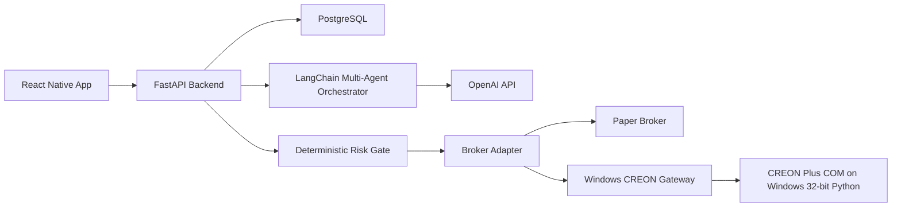

# Architecture

## Backend modules

- `app.api.routes`: HTTP endpoints.
- `app.services.agent_orchestrator`: specialist agents and final supervisor decision.
- `app.services.risk`: hard constraints that cannot be bypassed by the model.
- `app.services.trading_engine`: database persistence and order lifecycle.
- `app.broker.paper`: deterministic paper trading broker.
- `app.broker.creon`: CREON Plus COM adapter.
- `app.broker.creon_gateway`: HTTP client for the Windows native gateway.
- `gateway`: Windows native FastAPI service that owns COM calls.

## Multi-agent roles

- Market analyst: direction, trend, and quote quality.
- Risk analyst: drawdown, sizing, and stop concerns.
- Portfolio analyst: position and exposure view.
- Execution analyst: order type and execution feasibility.
- Supervisor: final structured decision after reviewing specialist outputs.

## Live trading boundary

The model never sends orders directly. It can only propose a structured decision. The `RiskManager` must approve the decision before `TradingEngine` creates an order. The broker adapter receives only approved orders.

Docker is not the live trading boundary. CREON Plus should run as a native Windows process or inside a full Windows VM because it depends on COM, HTS login state, and 32-bit callers.
